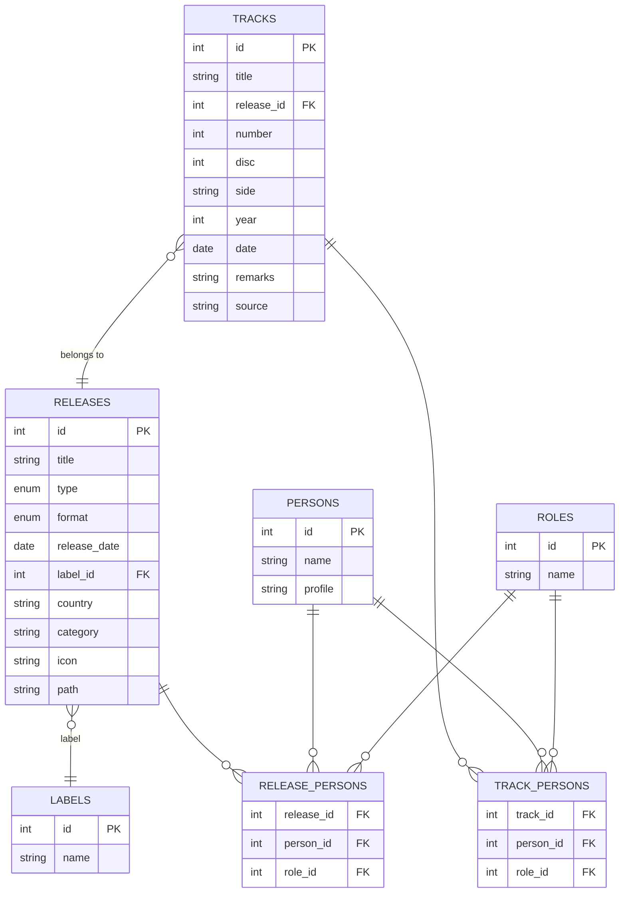

# BEATLES DB スキーマ設計・ER図（人物統合案）

このドキュメントは、ビートルズ関連データベースのスキーマ設計およびER図（Entity-Relationship Diagram）をまとめたものです。  
設計方針や正規化基準、主要テーブル・カラム構成も記載します。

---

## 設計方針・正規化基準（人物統合案）

- 一対多・多対多の関係は中間テーブルで正規化
- アルバム/シングル/EP/映画/MVなどは`releases`テーブルで一元管理
- **人物情報はpersonsテーブルで統合管理し、役割（role_id）で分野区別（演奏・作曲・アートワーク・映像・制作など）**
- 演奏・作曲・アートワークなどの「誰が何をしたか」は中間テーブルで表現
- 選択肢が少なく増減の少ない属性（format/type）はENUM型または定数管理を想定
- 備考や情報源はtracksまたはreleasesテーブルに付随

---

## ER図（Mermaid記法、人物統合案）

---

## テーブル一覧・補足

- `TRACKS` … 曲（トラック）ごとの基本情報
- `RELEASES` … リリース（アルバム、シングル、EP、映画、MV等）全般を管理
- `LABELS` … レーベル
- `PERSONS` … 人物（演奏者、作詞作曲者、アートワーク、映像、制作等あらゆる役割の人物を統合管理）
- `ROLES` … 役割・パート名（guitar, vocals, photography, director, producer, engineer等）
- `TRACK_PERSONS` … 曲単位での人物の役割（演奏、作詞作曲、制作など、1曲に1人が複数役割も可）
- `RELEASE_PERSONS` … リリース単位での人物の役割（アートワーク、映像等）

---

## 備考

- format/typeの詳細はENUMまたは対応表で管理
- 必要に応じてフィールド追加や関係調整してください
- PERSONSテーブルに外部IDや詳細プロフィールを追加しても良い

---