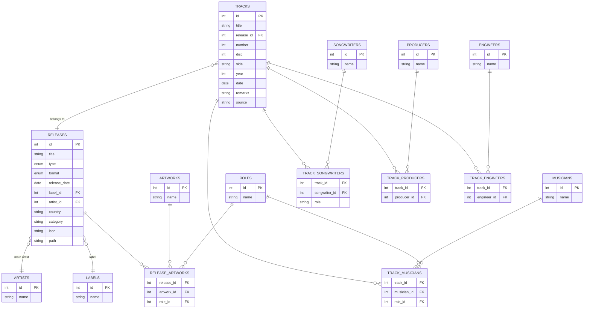

# BEATLES DB スキーマ設計・ER図

このドキュメントは、ビートルズ関連データベースのスキーマ設計およびER図（Entity-Relationship Diagram）をまとめたものです。  
設計方針や正規化基準、主なテーブル・カラム構成も記載します。

---

## 設計方針・正規化基準

- 一対多・多対多の関係は中間テーブルで正規化
- アルバム/シングル/EP/映画/MVなどは`releases`テーブルで一元管理
- 役割（パート名など）は`roles`テーブルで管理し、表記ゆれを排除
- 選択肢が少なく増減の少ない属性（format/type）はENUM型または定数管理を想定
- 備考や情報源はtracksまたはreleasesテーブルに付随

---

## ER図（Mermaid記法）

---

## テーブル一覧・補足

- `TRACKS` … 曲（トラック）ごとの基本情報
- `RELEASES` … リリース（アルバム、シングル、EP、映画、MV等）全般を管理
- `ARTISTS` … メインアーティスト
- `LABELS` … レーベル
- `MUSICIANS` … 参加ミュージシャン（ジョン、ポールなど含む）
- `ROLES` … パート名・役割（guitar, vocals, photography等）
- `SONGWRITERS` … 作詞作曲者
- `ARTWORKS` … アートワーク担当者
- `PRODUCERS` … プロデューサー
- `ENGINEERS` … エンジニア
- 中間テーブル（`TRACK_MUSICIANS`等）は多対多や役割付与のため

---

## 備考

- format/typeの詳細はENUMまたは対応表で管理
- 必要に応じてフィールド追加や関係調整してください